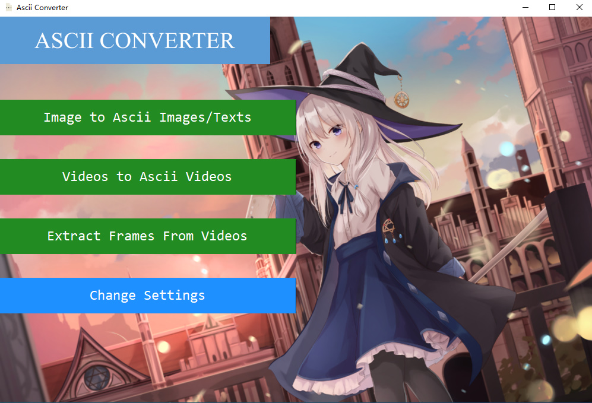
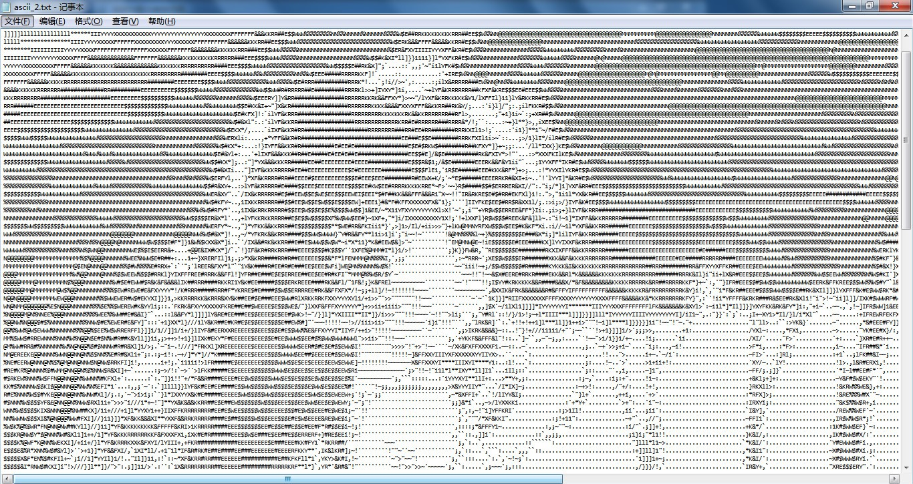

# ascii_converter

中文 [English](#English-version)

这是我一个人独立开发完成的字符画转换器，可以将任何图片和视频转换为ascii字符画。

大家可以通过系统自带的文件浏览框自选想要转换的图片或者视频文件的路径，

支持将图片转换之后输出为新的图片/文本文件，

视频转换后直接输出为ascii字符画视频（同时会输出指定的视频帧数范围内的每一帧的转换后的

ascii字符画图片在软件所在路径下的一个文件夹内）。

可自选想要转换的帧数范围以及输出的视频的帧数，可设置图片或者视频帧的缩放比例和字体种类以及字体大小。

除此之外还有很多可以设置的参数，这个软件是全中文的，因此大家可以直接看参数名称自己定制。

可以选择输出为彩色ascii字符画图片和视频。

(2020/12/14 最新版本的改动：之前显示字符画在软件屏幕上的功能感觉不是很有必要，因此在当前最新版本去掉了)  
(2021/5/21 最近我把字符画转换器整个重写了，现在在这里的是新版本，如果想要下载旧版可以[点击这里](https://www.jianguoyun.com/p/DWBzGQIQhPG0CBidmvUD)下载)  
当前最新版本可以[点击这里](https://www.jianguoyun.com/p/DSYMiNgQhPG0CBiLmvUD)下载

### 主界面

以下是我写的这个字符画转换器的主界面截图：

### 转换效果示例

把以下的图片按照缩放比例1:1（缩放倍数为1）转换为ascii字符画

在文本编辑器里打开转换后的ascii字符的文本文件

# English version

[中文](#ascii_converter) English

This is a character picture converter I developed independently, which can convert any pictures and videos to ascii character pictures.

You can select the path of the image or video file you want to convert by the system's own file browser box. Support outputting pictures as new picture/text files after conversion. The video will be output directly as ascii character picture video after conversion (at the same time, it will output each frame of the converted video within the specified frame number) ascii character pictures in a folder under the path of the software).

You can choose the range of frames you want to convert and the number of frames of the output video, set the scaling ratio and the font type and size of the picture or video frames.

Besides, there are many other parameters that can be set.

You can choose to output as color ascii characters to draw pictures and videos.

(2020/12/14 Changes in the latest version: the previous function of displaying character pictures on the software screen was not felt to be very necessary, so it was removed in the current latest version)  
(2021/5/21 I have recently rewritten the whole character drawing converter, now here is the new version, if you want to download the old version you can [click here](https://www.jianguoyun.com/p/DWBzGQIQhPG0CBidmvUD) download)  
The current latest version can be [click here](https://www.jianguoyun.com/p/DSYMiNgQhPG0CBiLmvUD) downloaded

### Main interface

The following is a screenshot of the main interface of this character drawing converter I wrote.

### Example of conversion effect

Convert the following image to ascii at a scaling ratio of 1:1 (scaling factor of 1)

Open the converted text file with ascii characters in a text editor

