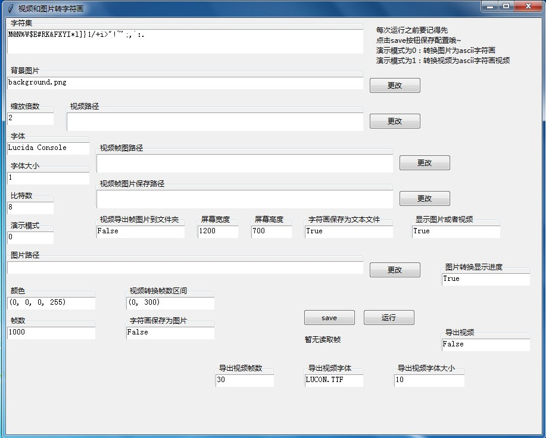
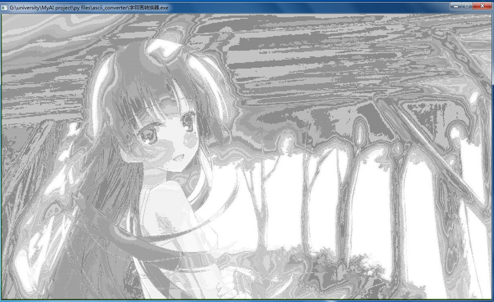
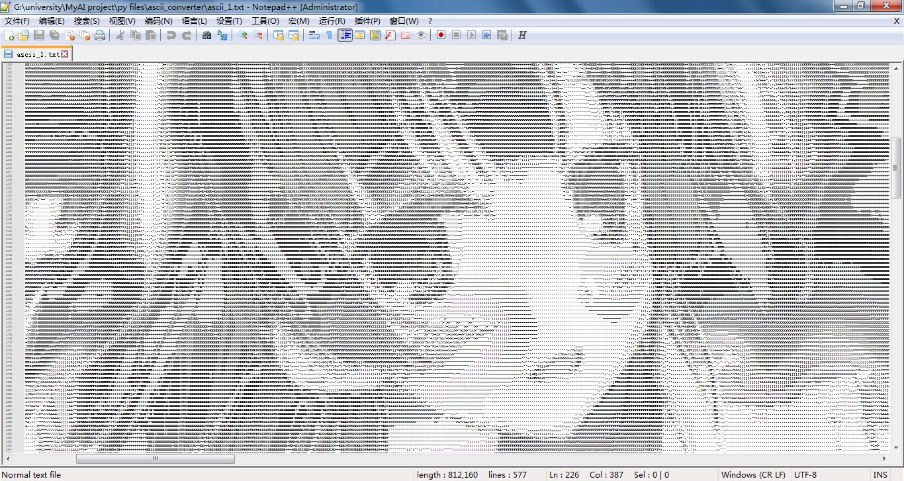

# ascii_converter
这是我一个人独立开发完成的字符画转换器，可以将任何图片和视频转换为ascii字符画。

大家可以通过系统自带的文件浏览框自选想要转换的图片或者视频文件的路径，

支持将图片转换之后输出为新的图片或者显示在软件的屏幕上，视频转换后直接输出为ascii字符画视频，

可自选想要转换的帧数范围以及输出的视频的帧数，可设置图片或者视频帧的缩放比例和字体种类以及字体大小。

除此之外还有很多可以设置的参数，这个软件是全中文的，因此大家可以直接看参数名称自己定制。

### 主界面

以下是我写的这个字符画转换器的主界面截图：

### 转换效果示例

把以下的图片按照缩放比例1:2（缩放倍数为2）转换为ascii字符画

在屏幕上显示转换后的ascii字符的效果

在文本编辑器里打开转换后的ascii字符的文本文件

