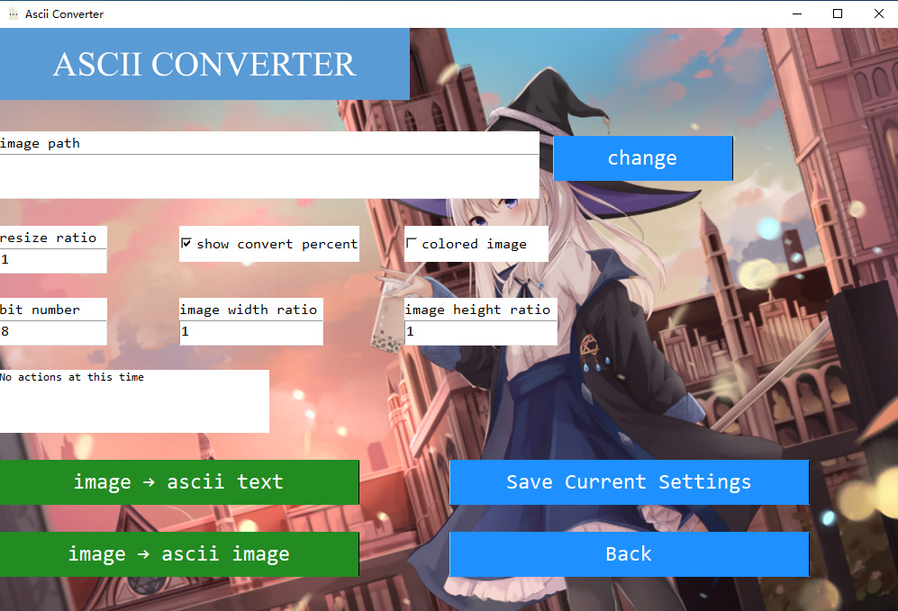

# ascii-converter

[中文](#ascii-converter-1) English

## Introduction

This is an ASCII art converter I developed on my own, which can convert any pictures and videos to ASCII art images, texts and videos.

You can select the path of the image or video file you want to convert by the system's own file browser box.

Support outputting pictures as new picture/text files after conversion.

The video will be output directly as ASCII character picture video after conversion, at the same time, it will output each frame of the converted video within the specified frame number in a folder under the path of the software.

You can choose the range of frames you want to convert and the number of frames of the output video, set the scaling ratio and the font type and size of the picture or video frames.

Besides, there are many other parameters that can be set.

You can also choose to output colored ASCII pictures and videos.

## Previews

### Main interface

The following is a screenshot of the main interface of this ASCII art converter I wrote.

### Example of conversion effect

Convert the following image to ASCII at a scaling ratio of 1:2 (scaling factor of 2)

Open the converted text file with ASCII characters in a text editor

## Download

This ASCII converter currently only supports Windows.

You can download the latest version [here](https://www.jianguoyun.com/p/DUPFUecQhPG0CBiUk6YE)

For the old version, you can download [here](https://www.jianguoyun.com/p/Db0nUwgQhPG0CBiSk6YE)

## Changelog

2021/5/21 I have recently rewritten the whole ASCII art converter mainly in terms of UI design and inner functionality.

2020/12/14 Changes in the latest version: the previous function of displaying character pictures on a new screen was not felt to be very necessary, so it was removed in the current latest version.

# ascii-converter

中文 [English](#ascii-converter)

## 介绍

这是我一个人独立开发完成的字符画转换器，可以将任何图片和视频转换为ASCII字符画。

大家可以通过系统自带的文件浏览框自选想要转换的图片或者视频文件的路径。

支持将图片转换之后输出为新的图片/文本文件。

视频转换后直接输出为ASCII字符画视频，同时会输出指定的视频帧数范围内的每一帧的转换后的ASCII字符画图片在软件所在路径下的一个文件夹内。

可自选想要转换的帧数范围以及输出的视频的帧数，可设置图片或者视频帧的缩放比例和字体种类以及字体大小。

除此之外还有很多可以设置的参数。

你也可以选择输出为彩色ASCII字符画图片和视频。

## 预览

### 主界面

以下是我写的这个字符画转换器的主界面截图：

### 转换效果示例

把以下的图片按照缩放比例1:2（缩放倍数为2）转换为ASCII字符画

在文本编辑器里打开转换后的ASCII字符的文本文件

## 下载

这个ASCII字符画转换器目前只支持Windows。

你可以从[这里](https://www.jianguoyun.com/p/DUPFUecQhPG0CBiUk6YE)下载最新的版本

你可以从[这里](https://www.jianguoyun.com/p/Db0nUwgQhPG0CBiSk6YE)下载旧版本

## 更新日志

2021/5/21 最近我把字符画转换器整个重写了，主要在UI设计和内部功能的方面。

2020/12/14 最新版本的改动：之前显示字符画在软件屏幕上的功能感觉不是很有必要，因此在当前最新版本去掉了。
